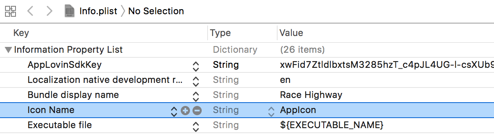
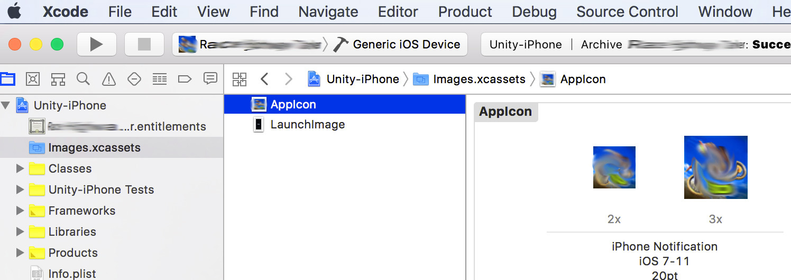

# xcode-ios-icon-template

Taken from:

https://stackoverflow.com/questions/46216718/missing-cfbundleiconname-in-xcode9-ios11-app-release

The reason this was made into a repo is because I ran into an issue where alpha layers are not supported by the Apple AppStore. Therefore, this repo is the original solution but the alpha layers have been removed from all icons.

## Instructions

1. clone this repo
2. Modify your Info.plist to include the following:

```xml
<key>CFBundleIconName</key>
<string>AppIcon</string>
```



3. Add the src folder to your xcode project


